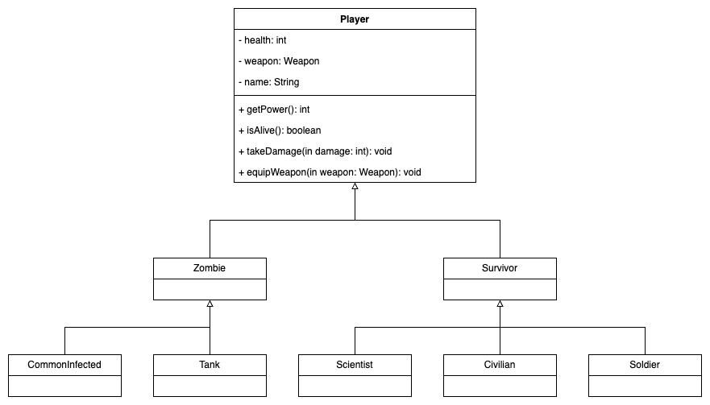

# CSC422 Zombie War Program

## Team Members

- [Norlander, Robert](shamotar@csp.edu)
- [Dallmann, Chase](dallmanc@csp.edu)
- [Haar, Keagan](haark@csp.edu)

## Project Description

This project is a simulation of a zombie war. The program will generate a random number of survivors and zombies. The survivors will attack the zombies and the zombies will attack the survivors. The program will continue until all the zombies are dead or all the survivors are dead.

## How to Use the Program

The program will generate a random number of survivors and zombies. The program will then simulate a battle between the survivors and the zombies. The program will continue until all the zombies are dead or all the survivors are dead. The program will then print out the results of the battle.

## How to Test the Program

To test the program, you can run the program multiple times to see if the results are consistent. You can also change the number of survivors and zombies to see how the program handles different numbers of survivors and zombies.

## UML Diagram

## Character Statistics

### Humans

| Character | Health | Attack |
| --------- | ------ | ------ |
| Civilian  | 50     | 5      |
| Scientist | 20     | 2      |
| Soldier   | 100    | 10     |

### Zombies

| Character      | Health | Attack |
| -------------- | ------ | ------ |
| Common Infected| 30     | 5      |
| Tank           | 150    | 20     |

## Weapon Statistics

| Weapon          | Damage | Accuracy |
| --------------- | ------ | -------- |
| Pistol          | 10     | 80%      |
| Shotgun         | 60     | 30%      |
| Assault Rifle   | 30     | 60%      |
| Submachine Gun  | 20     | 40%      |
| Axe             | 50     | 50%      |
| Crowbar         | 20     | 65%      |
| Frying Pan      | 15     | 70%      |
| Rocket Launcher | 200    | 15%      |
| Fists           | {var}  | 100%     |

## Change Log

### Release 1

We first implemented a working project that created an array of random characters, stated how many of each characters were generated and then printed out if any survivors made it or not and if so, how many. The program does the fighting sequence to see if the survivors can beat the zombies or not.

### Release 2

Attack logic was updated alongside print statements showing which characters were attacking who and how much damage was being done. Defender killed was printed when an attack brought someone to 0 health and survivor status printed after combat to see how many survived, if any.

### Release 3

Added weapons for the characters to be able to use, with associated chances to hit and damage unique to each weapon. Also, updated the way we organized our program as we put every class into separate files.
